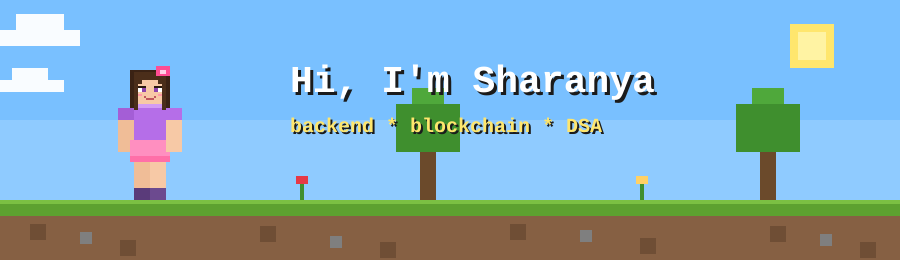

  

<h3 align="center">⛏️ 2nd-year CSE @ NMAMIT · Backend · Blockchain forensics · DSA</h3>

---

### 🧱 Things I've built

- ⛓️ **[SatoshiTrace](https://satoshitrace.vercel.app/)**: Bitcoin privacy intelligence tool that shows what the chain thinks is anonymous
- 🕵️ **[Coin UTXO](https://coinutxo.vercel.app/)**: crypto fraud attribution workspace. Multi-hop tracing from scam wallet to exchange, with case reports
- 🌐 **[Portfolio](https://portfolio-websitee-liard.vercel.app/index.html)**: all my projects in one place

### 🎒 Inventory

- 🌱 **Currently learning:** Go · Solidity · System Design · DSA (C++)
- 💬 **Ask me about:** Blockchain forensics, Go APIs, DSA, public speaking 🎤
- 📫 **Reach me:** sharanyashetty013@gmail.com
- ⚡ **Fun fact:** I trace stolen crypto for fun and call it a hobby

### 🔗 Connect with me

  
  
  
  

### 🛠️ Tools

  
  
  
  
  
  
  
  
  

### 📊 GitHub stats

  

  

### 🧠 LeetCode

  

